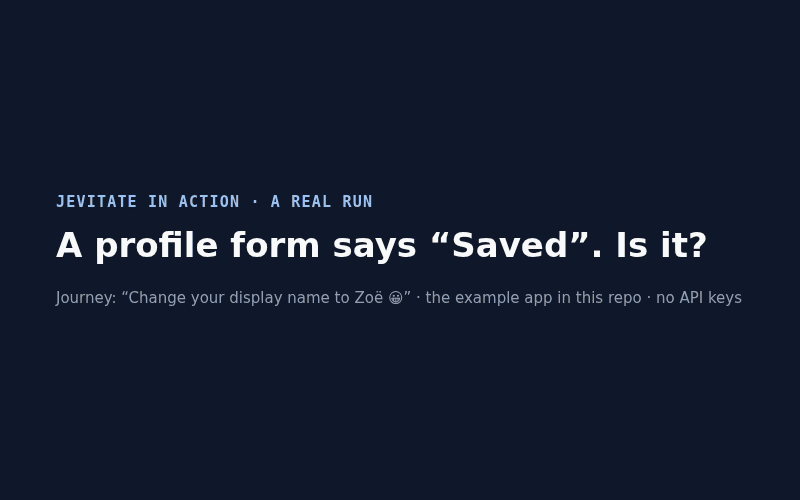

# Jevitate

**Autonomous browser testing that turns discovered bugs into deterministic regression tests.**

[](https://github.com/matt-cochran/jevitate/actions/workflows/ci.yml)
[](https://www.npmjs.com/package/@jevitate/cli)
[](./LICENSE)

[Website](https://jevitate.com) · [Docs](./docs/README.md) · [Demo](./docs/demo.md) · [Changelog](./CHANGELOG.md)

Jevitate explores your web app in a real browser, tries to break it, and reports only what the
browser can prove: HTTP 5xx responses, uncaught exceptions, hangs, failed success checks, broken
rules you declare. Each defect comes with a Recording that reproduces it. Jevitate replays it to
confirm a fix and commits it as a regression you can run in CI.

**Nondeterministic discovery. Deterministic verification.** A model may suggest what to try next.
It never decides whether your software passed.

<p align="center"></p>

> **Demo:** a 2-minute, no-API-key walkthrough is in [docs/demo.md](./docs/demo.md). A form says
> "Saved" while the server returns HTTP 500. Jevitate finds it, reproduces it 3/3, commits it as a
> regression, and verifies the fix.

## From "write a test" to "find the test you didn't write"

```text
Traditional E2E:  you write a test ──► it runs ──► it catches the failures you anticipated

Jevitate:         explore ──► detect (evidence) ──► reproduce ──► commit a regression ──► verify the fix
                  (goal, adversarial,   (code-decided   (replay in     (regression capture)   (verify-fix,
                   coverage, feature)    oracles)        fresh contexts)                        regression run)
```

Jevitate doesn't replace the E2E tests you write. It finds the failures nobody wrote a test for,
and hands each one back as a deterministic artifact.

## Quick start

Needs Node.js 20+ and an app running locally (examples use `http://localhost:3000`).

**1. Install**

```bash
npm install -g @jevitate/cli
jevitate install-browser                 # the pinned browser Jevitate drives (shared, never removes other revisions)
```

**2. Set up the repo**. Run this from your app's repository:

```bash
jevitate init
```

It creates `.jevitate/` (Journeys, regressions, baselines, logs, and an example
`environments.json`), installs [agent skills](./docs/agents.md) for Claude Code, Codex, Cursor
and `AGENTS.md`, registers the MCP server, and asks for any missing keys (`OPENROUTER_API_KEY` for
text generation, and also for Jev's judgment unless `TYPESAFE_API_KEY` is set; see
[docs/authentication.md](docs/authentication.md#api-keys-for-jevitates-own-ai)). Keys are optional for step 3. Without a
terminal (CI, a coding agent), `init` never prompts: it reports which keys are missing, and you
add them later with `jevitate ai setup <generation|judgment>`. It ends with a short **next steps**
list that fits what it set up.

Key entry is masked (each character shows as `•`; the instructions stay on screen). `init` and
`jevitate ai status` name each key, its provider and where it comes from (`from env
OPENROUTER_API_KEY` or `from ~/.jevitate/credentials.json`), and check it with the provider (a
live, non-billable auth call: `valid`, `INVALID (HTTP 401)`, or `could not verify`). A key the
provider rejects is never stored. To rotate or replace a stored key, run `jevitate ai setup
<feature> --replace` (or `jevitate init --replace-keys` for all of them). Offline or in CI, pass
`--no-verify`. See [authentication](./docs/authentication.md#api-keys-for-jevitates-own-ai).

**3. First run: try to break a form.** No keys needed, because the adversarial mission plans its
misuse in code:

```bash
jevitate explore --strategy adversarial --url http://localhost:3000/settings --fake-ai
```

It double-submits, feeds empty, boundary, long, unicode and invalid values, cancels and reloads
mid-edit, and acts while a save is still pending. It prints the outcome (`clean`,
`defects-found`, `inconclusive`, …), each defect with its fingerprint, the result file and a
`next:` step. The full result (evidence, the Recording, a ready-to-file issue draft) goes under
`.jevitate/logs/<date>/` ([where jevitate keeps things](./docs/operations.md#where-jevitate-keeps-things)).
`--json` prints it as a JSON envelope instead. The exit code is the outcome
([table below](#mission-outcomes-and-exit-codes)).

- Jevitate only visits the `--url`'s origin. Add `--allow <origin>` for each origin the app needs,
  and include the app's own origin too, since `--allow` replaces the default.
- `--fake-ai` swaps the mission's advisory model calls for deterministic stand-ins. Nothing it
  reports depends on them.
- Logged-in app? Add `--storage-state auth.json` ([authentication](./docs/authentication.md)).
- Part of the flow runs in a browser extension (side panel, popup)? Add `--extension <dir>`
  ([browser extensions](./docs/extensions.md)).

With keys, a **goal-directed run** reaches an end state, and code checks it:

```bash
jevitate explore --url http://localhost:3000/profile --goal "set the last name to Litmus and save" \
  --success 'requestMade:PUT /api/profile' --success 'reloadThen:valueEquals:[data-testid=last-name]|Litmus' \
  --real
```

It succeeds only if the save request was sent and the value survived a reload. The model saying
"done" doesn't count.

**4. Next steps**

| To | Run | Docs |
| --- | --- | --- |
| keep a flow as a replayable Journey | `jevitate explore-author-journey --url <url> --goal "…" --success "…" --id checkout --name Checkout --real`, then `jevitate journey promote checkout` | [journeys](./docs/journeys.md) |
| record a flow by clicking through it | `jevitate record --url <url>` | [journeys](./docs/journeys.md#record-a-flow-by-demonstration) |
| replay it anywhere | `jevitate journey run checkout --env staging` | [environments](./docs/journeys.md#environments---env) |
| make a narrated demo | `jevitate demo "Save your display name" --env local --success "…" --real` | [demos](./docs/journeys.md#demo-an-aspect-from-a-one-line-request) |
| prove a fix, with evidence | `jevitate verify-fix --result <run>.result.json --fingerprint <fp> --record-video` | [verification](./docs/verification.md) |
| gate CI | `jevitate check --suite jevitate-suite.json` (JUnit + SARIF; exit 1 = a gating finding) | [ci](./docs/ci.md) |
| let your coding agent drive | ask it in plain words. The skills and MCP tools `init` installed do the rest | [agents](./docs/agents.md) |

## See it work

The [demo](./docs/demo.md) runs against the repo's example app. It needs no keys and all of its
output is real:

```bash
jevitate explore --strategy adversarial --url http://127.0.0.1:5190/demo/profile \
  --invariants apps/example-site/demo-invariants.json --fake-ai --out demo-runs
# outcome: defects-found. "HTTP 500 from /demo/api/profile", and the invariant
# "saved-means-stored" (the page said Saved, but the server kept the old name)

jevitate verify-fix --result "$RESULT" --fingerprint "$FP_500"
# verdict: still-reproduces. "the defect's fingerprint fired on all 3/3 replay(s) that ran"

jevitate regression capture --from "$RECORDING" --result "$RESULT" --fingerprint "$FP_INV" \
  --id saved-means-stored --dir demo-regressions
jevitate regression run saved-means-stored --dir demo-regressions   # reproduces (exit 1)
# ...fix the bug, restart the app...
jevitate regression run saved-means-stored --dir demo-regressions   # fixed (exit 0)
```

### Watch it run (demo mode)

Every run is headless by default, CI included. To show an audience what jevitate does, open a
visible browser and slow it down, or record it:

```bash
# A visible Chromium, each browser operation slowed by 250 ms (override with --slow-mo <ms>):
jevitate explore --strategy adversarial --url http://127.0.0.1:5190/demo/profile --fake-ai --headed

# Headless, recorded: the videos are listed in the result (videoPaths) and the summary (VIDEO)
jevitate explore --strategy adversarial --url http://127.0.0.1:5190/demo/profile --fake-ai --record-video
```

`--headed` (or `JEVITATE_HEADED=1`), `--slow-mo <ms>` and `--record-video [dir]` work on every
`explore` strategy, `journey run` and `verify-fix`; `regression capture|run` take `--headed` and
`--slow-mo`. A headed explore run also shows an on-page overlay (hide it with `--no-overlay`).
`--headed` needs a display: without one (no `DISPLAY`/`WAYLAND_DISPLAY` on Linux; WSL2 needs WSLg)
it is refused (exit 64) — use `--record-video` instead. See
[operations: demo mode](./docs/operations.md#demo-mode-watching-a-run).

Evidence for a defect, and screenshots of any run:

```bash
# Per defect: its minimal repro replayed with captions, the failing step marked with the actual
# signal ("Save → server returned 500 (PUT /api/profile)"), a clip + before/at screenshots
# (defects[].evidence; linked from the issue draft, report, JUnit and SARIF)
jevitate explore --url http://127.0.0.1:5190/demo/profile --goal "save the profile" --fake-ai --evidence-video

# One masked screenshot per distinct screen (or `--screenshots steps`: one per step) + index.md
jevitate journey run my-journey --screenshots
```

`--screenshots [screens|steps|<dir>]` works on every `explore` strategy, `journey run|annotate|demo`
and `verify-fix`; `verify-fix --record-video` gives a before/after clip pair. Registered secrets are
masked in the pixels of every clip and screenshot (a capture whose mask cannot be proven is skipped,
never written). See [operations: evidence and screenshots](./docs/operations.md#evidence-clips-and-screenshots).

## Journeys, environments and demos

A **Journey** is a replayable, typed flow you author from a goal, record by demonstration, or get
from `explore`. It runs the same on every machine, self-heals under policy and loads as a test in
CI ([Journeys](./docs/journeys.md)).

```bash
# Intent: why, not only what. Drafts goals, success criteria and per-step objectives on playback;
# nothing is written until you review and approve.
jevitate journey annotate checkout --real
jevitate journey annotate checkout --approve

# Environments: a Journey knows no host. Name yours in .jevitate/environments.json (committed, no
# secrets), then pick one per run. A step on any other origin is refused before a browser opens.
jevitate journey run checkout --env staging
jevitate regression run saved-means-stored --base-url http://localhost:3000

# A narrated demo of a Journey: video + .vtt subtitles + a Markdown guide with screenshots
jevitate journey demo checkout --env staging --video demos/checkout.webm --guide demos/checkout.md

# Or from a one-line request: explore -> minimize -> author -> annotate -> DRAFT demo
jevitate demo "check out with a saved card" --env staging --success 'urlIncludes:/order/confirmed' --real
jevitate demo approve <id>          # the one human approval: renders the final demo, promotes the Journey
```

Existing Journeys keep working unchanged: intent fields and environments are optional.
`--env`/`--base-url` work on `journey run|annotate`, `regression run` and `load run`. Sessions and
secret fields per environment live in `~/.jevitate/targets.json`, never in the repo. `demo` refuses
an environment flagged `production: true`. Details: [Journeys](./docs/journeys.md#annotate-a-journey-draft-its-intent-then-approve-it),
[environments](./docs/journeys.md#environments---env), [demos](./docs/journeys.md#demo-a-journey-video-subtitles-and-a-step-by-step-guide).

## Why Jevitate?

Hand-written E2E tests check the paths someone thought of. The bugs that reach users tend to sit
somewhere else: a double submit, a name with an emoji, a reload halfway through an edit, a
request that hangs, a page that says "Saved" when the server said 500.

Autonomous agents can find those paths, but "the AI said it looks broken" is not a test result,
and an agent that clicked around once is not a regression suite. Jevitate keeps the exploration
and replaces the judgment with evidence:

- **Findings are evidence, not opinions.** A defect is concluded only by code: a hard signal
  from the browser, a check you wrote, or an invariant you declared.
- **Every finding is reproducible.** It comes with the exact steps, replayable in a fresh
  browser, and a stable fingerprint that dedupes it across runs.
- **Fixes are verified, not assumed.** `verify-fix` replays 3 times by default. An intermittent
  signal is reported as `intermittent`, never as `fixed`.
- **Runs are honest.** A run that could not do its work (the page never rendered, it redirected
  to a login page, it exercised too little of the form) is `inconclusive`, never `clean`.

## How it works

| | Decided by |
| --- | --- |
| **What to try next** | Goal and usability missions: **Jev** ([TypeSafe](https://typesafe.ai)'s judgment model) picks among the controls code found. Adversarial, coverage, exploratory and `--feature` missions: **code strategies**, with Jev's opinion recorded as advisory only. |
| **Whether it failed** | **Code only**: HTTP 5xx, uncaught exceptions, console errors, failed requests, hangs confirmed by replay, your `--success` checks, your [invariants](./docs/invariants.md), your [backend log](./docs/backend-logs.md) matchers. |
| **Whether it's fixed** | **Replay**: the finding's Recording, in fresh browser contexts, compared by fingerprint. |
| **What gets committed** | A **Recording** (typed, deterministic steps) plus its oracle, minimized where possible. |

More: [how it works](./docs/how-it-works.md), including the architecture and package map.

## Capabilities

| | |
| --- | --- |
| **Missions** | `explore` with a `--goal`, or `--strategy adversarial \| coverage \| exploratory \| usability`, or `--feature <name>` ([exploration](./docs/exploration.md)) |
| **Success checks** | URL, visibility, text, values, counts, network (`requestMade`, `responseStatus`), persistence (`reloadThen`), computed style and layout. Find-out goals are answered only with grounded claims ([success checks](./docs/success-checks.md)) |
| **App-declared invariants** | rules over DOM, network and read-only probes, checked around every action ([invariants](./docs/invariants.md)) |
| **Reproduce and verify** | `verify-fix`, `regression capture`, `regression run`, and `ledger add` / `ledger verify` to re-check a finding by fingerprint long after its run ([verification](./docs/verification.md)) |
| **CI** | `jevitate check --suite` with a budget, JUnit and SARIF; `report` and `diff` for deduped findings and baselines ([CI](./docs/ci.md)) |
| **Real apps** | storage-state logins, bound secrets and TOTP, fixtures that reset state around every replay, repeat-and-vote, persona and multi-actor runs ([auth](./docs/authentication.md), [fixtures](./docs/fixtures.md), [multi-run](./docs/multi-run.md)) |
| **Evidence** | hangs (confirmed by replay), page timing, backend log correlation, redacted issue drafts ([exploration](./docs/exploration.md), [operations](./docs/operations.md)) |
| **Journeys** | author a replayable flow from a goal, replay, self-heal under policy, load-test, share ([Journeys](./docs/journeys.md)) |
| **Demos** | `journey demo` renders a Journey as a narrated video, `.vtt` subtitles and a step-by-step guide; `demo "<aspect>" --env <name> --success <check>` explores, minimizes, annotates and drafts one from a one-line request, and `demo approve <id>` promotes it ([demos](./docs/journeys.md#demo-an-aspect-from-a-one-line-request)) |
| **Usability review** | ranked, cited findings: claims verified by code (a probe, the product facts, observed friction). Advisory, never a gate ([UX findings](./docs/ux-findings.md)) |

## Use it from your coding agent

Jevitate gives Claude Code, Codex, Cursor or any MCP client a bounded QA loop: run a mission,
read a typed result, re-check a finding after a fix.

```bash
jevitate init                      # installs skills for detected agents and registers the MCP server
jevitate mcp --print-config claude # or cursor | codex | json: print the snippet, write nothing
```

Run non-interactively like this, `init` never prompts for keys — it reports what's still missing
(`keys: generation not configured — set OPENROUTER_API_KEY (OpenRouter) or run \`jevitate ai setup generation\``)
and exits 0 regardless, since the rest of init (skills, MCP registration) still succeeded. Set the
keys separately with `jevitate ai setup <generation|judgment>`.

The MCP server exposes an allowlist of domain tools (`run_journey`, `queue_exploration`,
`get_mission_result`, `verify_fix`, `annotate_journey`, `create_demo`, `run_check`, …). MCP is a
convenience for agents that could run the CLI anyway, so every CLI command is reachable over MCP and
every MCP tool from the CLI; the tools that mirror a command run it in process with typed, closed
arguments and confined paths. Only `mcp`, `ui`, `init`, `ai setup`, `record` and trusting a source
stay off MCP, each for a stated reason. Raw browser tools such as `browser_click` or `page_evaluate`
are forbidden: an agent asks for a mission or a Journey, it never drives the page. Approving or
cancelling an inbox item stays human-only, in `jevitate ui`. See [agents and MCP](./docs/agents.md).

## Queue missions and read the inbox from the CLI

Everything an agent can do over MCP you can do from the shell, over the same stores
(`~/.jevitate/missions/`, `~/.jevitate/inbox`):

```bash
jevitate mission queue spa --strategy coverage --route '/settings/**'   # enqueue against a promoted target
jevitate mission run                                                    # drain the queue
jevitate mission result <id>                                            # status + typed result; exits with its contract code
jevitate inbox list                                                     # also: show, command, queue-retrieval, queue-action, health
```

`inbox command <id>` is burn-after-read like MCP's `get_command`: unread human input needs
`--reveal`, which consumes and prints it. Approving or cancelling an inbox item stays human-only
(`jevitate ui`). Flags: [docs/cli.md](./docs/cli.md).

## Safety

- **Only origins you authorize**, checked before the browser opens and during the run.
- **Bounded**: hard action and decision ceilings, plus a no-progress detector, on every autonomous loop.
- **No dangerous clicks by default**: sign-out, delete, revoke and paid controls are refused
  unless you pass `--allow-destructive`. Find-out goals are read-only unless you pass
  `--allow-writes`, and hang replays never re-send a paid write. Every write request a run
  fires is listed.
- **Secrets never reach a model**: a redaction guard that fails closed, and bound secrets typed
  by code.
- **Page text is data, never instructions**: model prompts carry a prompt-injection guard.

Details: [safety model](./docs/safety.md) · [SECURITY.md](./SECURITY.md).

## Mission outcomes and exit codes

A run never answers with a crash. Every run ends in a typed outcome, and its transcript and
Recording are flushed step by step.

| Outcome | Exit | Meaning |
|---|---|---|
| `clean` | 0 | finished its budget and found nothing (goal: the success checks held) |
| `defects-found` | 1 | at least one confirmed defect (goal: a success check did not hold) |
| `inconclusive` / `crashed` | 2 | the run itself could not do its work, so its silence proves nothing |
| `hang` | 3 | the app hung, and the hang reproduced on replay |
| `intermittent` | 4 | a hang was observed but did not reproduce on every replay |

A usage or input error (a bad flag, an unreadable suite, an unknown id) exits `64`, never `1`.
Goal runs also report their own `outcome` (`succeeded`, `failed`, `exhausted`, `blocked`, …). Every value, and
the [exit codes for every command](./docs/outcomes.md#exit-codes), is in
[docs/outcomes.md](./docs/outcomes.md). Without `--json`, commands print a human summary; with
`--json`, the JSON envelope.

## Authenticated missions

`--secret` only **redacts** a value. To start logged in, pass a Playwright storageState
(`--storage-state auth.json`). To drive a login form, bind a field to an environment variable
(`--secret-field 'label=Password=env:APP_PASSWORD'`, plus `--totp` for MFA): code types it, and the
model only sees `«secret:VAR»`. Details: [docs/authentication.md](./docs/authentication.md).

## Status

Jevitate is pre-1.0 and under active development. Known limitations worth knowing:

- Goal and usability runs need API keys (`--real`), and they cost money per model call. Runs
  report `usage` with the full cost of Jev and generation calls; a model with no known price
  makes the total `partial` until you configure one
  ([operations](./docs/operations.md#usage-accounting)).
- Stateful and conversational runs against one account must run sequentially
  ([why](./docs/authentication.md)).
- A hard-signal defect (e.g. an HTTP 500) is re-checked with `verify-fix`, not committed by
  `regression capture`. Declare the broken rule as an invariant to commit it
  ([verification](./docs/verification.md)).
- UX quality findings (`jevitate ux`, `explore --strategy usability`) are a PREVIEW and advisory.
  Each finding is a claim verified by code, but Jev's categorization and the two-question grade
  are tuned on fixtures only, not yet calibrated with the real model across apps
  ([UX findings](./docs/ux-findings.md), [#198](https://github.com/matt-cochran/jevitate/issues/198)).
- Chromium only.

## Documentation

- [Docs index](./docs/README.md): every reference page
- Full command reference: [docs/cli.md](./docs/cli.md)
- [Demo](./docs/demo.md) · [How it works](./docs/how-it-works.md) · [Safety](./docs/safety.md)
- [Changelog](./CHANGELOG.md) · [Releasing](./RELEASING.md)
- Website: [jevitate.com](https://jevitate.com)
- Related: [Journeeze](https://journeeze.dev) (coming soon): Jevitate proves what the browser can
  prove; Journeeze adds what only people can tell you: what they like, dislike and don't
  understand, anchored to the same journeys and clustered into GitHub issues.
  [Early access](mailto:contact@journeeze.dev?subject=Journeeze%20early%20access)

## Contributing

Bug reports, feature ideas and pull requests are welcome. Start with
[CONTRIBUTING.md](./CONTRIBUTING.md). It covers the local setup, how to run a single test file,
and the few invariants every change must keep. Please report security issues privately
([SECURITY.md](./SECURITY.md)).

```bash
pnpm install && pnpm -r build
pnpm exec vitest run packages/explore/src/success-checks.test.ts   # one test file
pnpm lint
```

## License

[MIT](./LICENSE)
